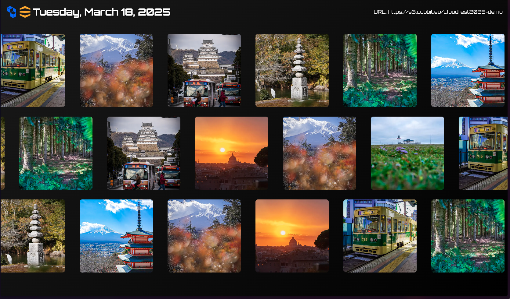

# Cubbit Slideshow Demo

A Next.js application demonstrating file upload and slideshow capabilities using Cubbit DS3 storage.
The application allows photos to be uploaded to a designated S3 bucket and displayed in a slideshow. Photos will be grouped by date (with a year/month/day folder structure) and the slideshow will show photos taken during the current day.



## Prerequisites

- Node.js 18 or later
- npm
- Docker (optional, for containerized deployment)

## Getting Started

### Local Development

1. Clone the repository:

```bash
git clone https://github.com/marmos91/cubbit-slideshow-demo.git
cd cubbit-slideshow-demo
```

2. Install dependencies:

```bash
npm install
```

3. Create a `.env.local` file with your configuration:

```env
# S3 Configuration (Server-side)
S3_REGION=eu-central-1                    # The region where your S3 bucket is located
S3_ACCESS_KEY_ID=your_access_key          # Your S3 access key ID
S3_SECRET_ACCESS_KEY=your_secret_key      # Your S3 secret access key
MULTIPART_THRESHOLD=5242880               # Threshold in bytes (5MB) for multipart uploads

# Public Configuration (Client-side)
NEXT_PUBLIC_S3_BUCKET_NAME=your_bucket    # Your S3 bucket name
NEXT_PUBLIC_MAX_FILE_SIZE=10485760        # Maximum file size in bytes (10MB)
NEXT_PUBLIC_S3_ENDPOINT=your_endpoint     # Your S3-compatible endpoint URL
```

4. Start the development server:

```bash
npm run dev
```

The application will be available at `http://localhost:3000`.

### Environment Variables Explained

#### Server-side Variables

- `S3_REGION`: The geographical region where your S3 bucket is hosted
- `S3_ACCESS_KEY_ID`: Your S3 access credentials for authentication
- `S3_SECRET_ACCESS_KEY`: Your S3 secret key for authentication
- `MULTIPART_THRESHOLD`: The size threshold (in bytes) that triggers multipart upload. Files larger than this will be uploaded in chunks

#### Client-side Variables (NEXT_PUBLIC_*)

- `NEXT_PUBLIC_S3_BUCKET_NAME`: The name of your S3 bucket where files will be stored
- `NEXT_PUBLIC_MAX_FILE_SIZE`: Maximum allowed file size for uploads (in bytes)
- `NEXT_PUBLIC_S3_ENDPOINT`: The endpoint URL for your S3-compatible storage service

Note: All `NEXT_PUBLIC_` variables are exposed to the browser. Never put sensitive credentials in NEXT_PUBLIC_ variables.

### Production Build

To create a production build:

```bash
npm run build
npm run start
```

## Docker Deployment

This project includes Docker support for containerized deployment.

1. Build the Docker image:

```bash
docker build -t cubbit-slideshow-demo .
```

2. Run with Docker Compose:

```bash
docker-compose up -d
```

The application will be available at `http://localhost:3000`.

## Usage

Just visit:

- `http://localhost:3000/upload` to upload new photos
- `http://localhost:3000/slideshow` to see the slideshow in action.
